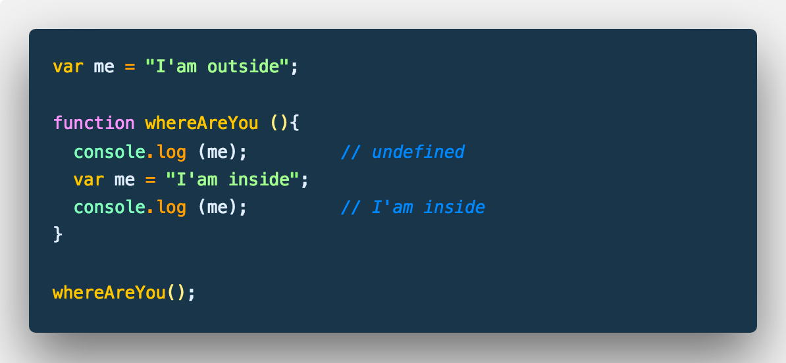
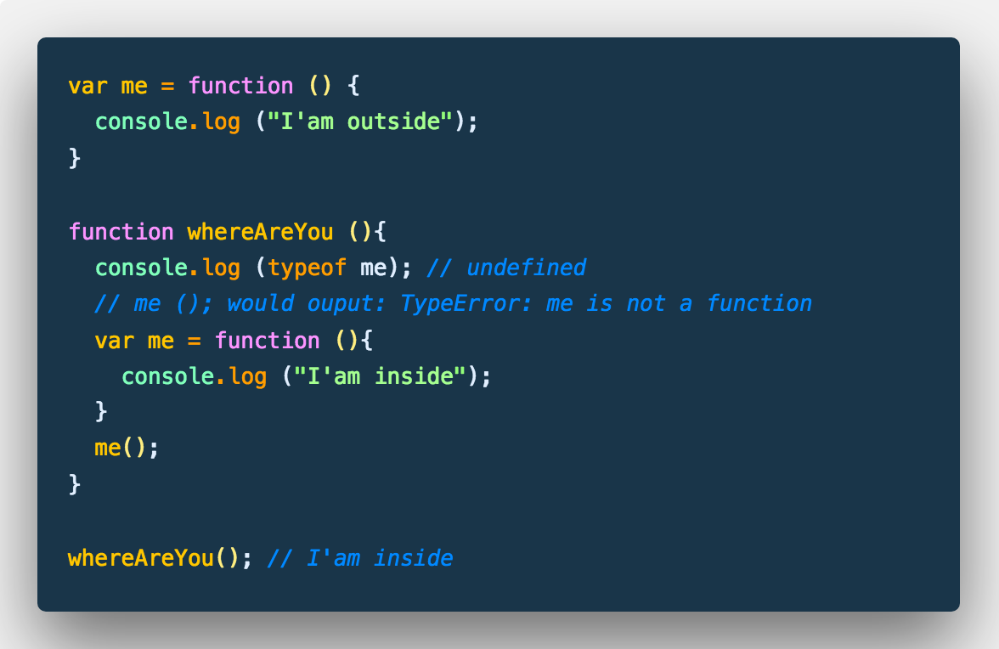
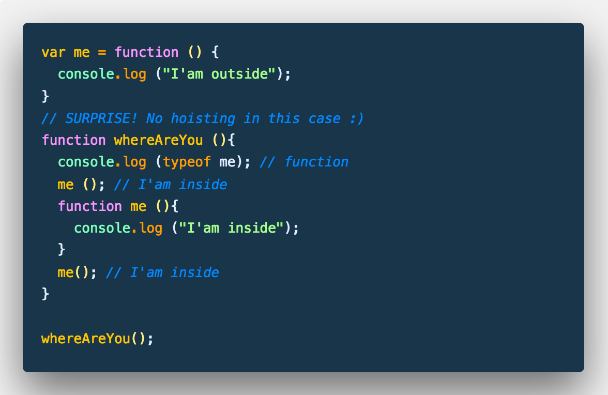

# JavaScript Documentation

In deutscher Sprache (and sometimes in & English) :)

## Use Strict

```javascript
"use strict";
```

## Unabsichtlich erzeugte globale Variablen

```javascript
var a = b = 0; // b globale Variable
```

Globale Variablen sind Eigenschaften des globalen Objektes und können daher auch mit `delete` gelöscht werden.

## Zugriff auf das globale Objekt

```javascript {cmd="node"}
var global = (function(){
  return this;
}()); // Man beachte die zusäztlichen Klammern

console.log(global);
```

## Basic Statements

## [for](./source/basic_statements/for.js)

## [do while](./source/basic_statements/do_while.js)

## [while](./source/basic_statements/while.js)

## [switch](./source/basic_statements/switch.js)

## Hoisting





## Performant `for` loops

### Suboptimal

```javascript
for (var i=0; i < myarray.length; i++){
  // ....
}
```

### Besser

```javascript
for (var i=0, max=myarray.length; i < max; i++){
  // ....
}
```

### Noch besser

```javascript
for (var i=myarray.length; i--){
  // ....
}
```

### Best (with while loop)

```javascript
var myArray = [], i = myArray.length;
while (i--) {
  // ....
}
```

## `for in` loop with `hasOwnProperty()`

```javascript
for (var i in whatever ){
  if (whatever.hasOwnProperty(i)) {
    // ....
  }
}
```

## Erweitern von eingebauten Prototypen

```javascript
if (typeof Object.prototype.myMethod !== 'function') {
  Object.prototype.myMethod = function () {
    // Implementierung
  }
}
```

## Konstruktoren mit Großbuchstaben beginnen

```javascript
function MyWhateverConstructor () { ... }
function myWhateverFunction () { ... }

var myWhatever = new MyWhateverConstructor ();
myWhateverFunction ();
```

## Selbst aufrufender Konstruktor

Hilft, wenn `new` vergessen wird.

```javascript {cmd="node"}
function Whatever () {
  if (!(this instanceof Whatever)) {
    return new Whatever();
  }
  this.description = "It is whatever!";
}

var w1 = new Whatever(),
    w2 = Whatever();

console.log (
  w1.description, // It is whatever!
  w2.description, // It is whatever!
);
```
