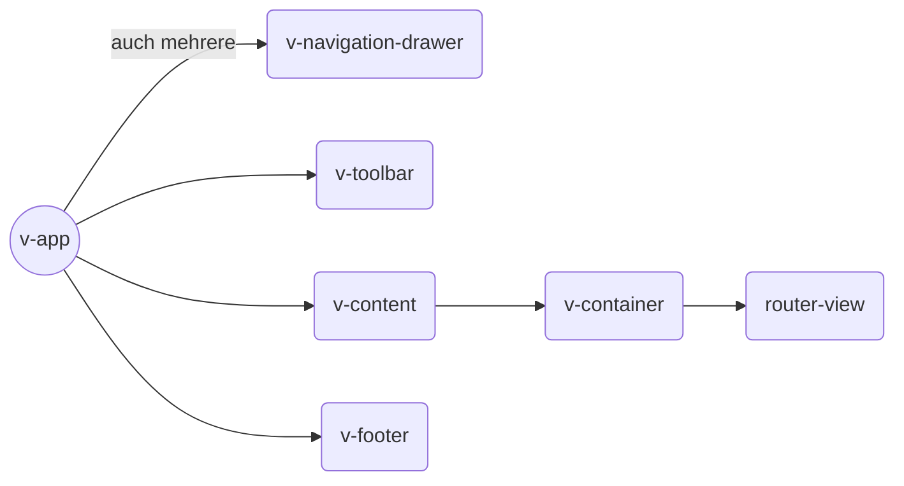

---
ebook:
  title: Vuetify
  pdf:
    paper-size: A4
    default-font-size: 14   
---


# Vuetify {ignore: true}

<!-- @import "[TOC]" {cmd="toc" depthFrom=1 depthTo=6 orderedList=false} -->

<!-- code_chunk_output -->

* [Introduction](#introduction)
* [Design Principles](#design-principles)
	* [Layouts](#layouts)
		* [Basis Example](#basis-example)
* [Snippets](#snippets)
	* [Light or dark theme for the application](#light-or-dark-theme-for-the-application)
	* [Centering vertically](#centering-vertically)
	* [Turn off default scroll bar](#turn-off-default-scroll-bar)
	* [`activator` pitfalls](#activator-pitfalls)

<!-- /code_chunk_output -->


## Introduction

Vuetify supports:

* SSR/SPA/PWA/..
* Standard Browser
  * Chrome, Safari 10+
  * Firefox
  * Edge
  * Pollyfill: IE11, Safari 9

==**Not supported:** IE10/9/..==

## Design Principles

Vuetify is developed exactly according to Material Design spec.

### Layouts

#### Basis Example



## Snippets

### Light or dark theme for the application

```jsx
<v-app class="application application-light">.. // or dark
```

### Centering vertically

```jsx
<v-container fill-height>.. // also child components v-layout
```

### Turn off default scroll bar

```jsx
html { overflow-y: auto }
```

### `activator` pitfalls

When not using the activator slot for `v-menu` and v-dialog for example, you must manually stop the propagation of the click event. To do this, simply add the .stop modifier to the click event, `@click.stop="myMethod"`.
