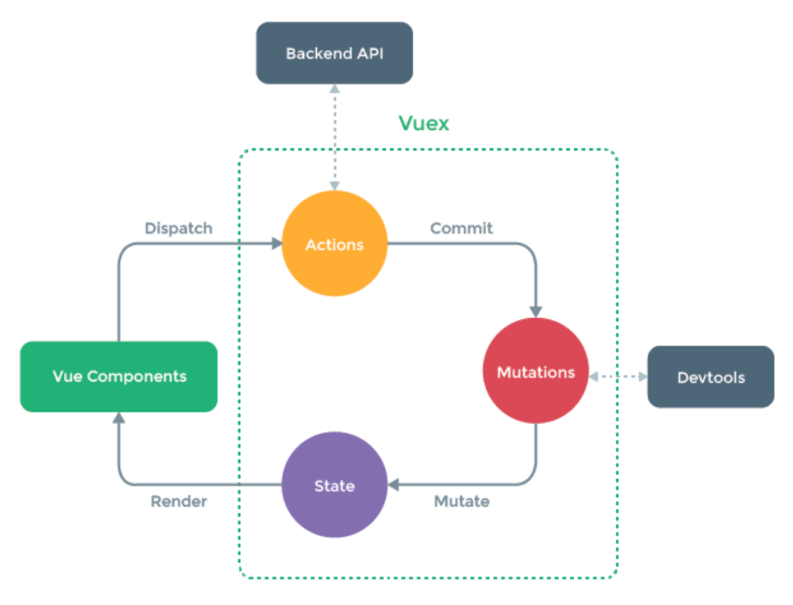

---
ebook:
  title: Vuex
  pdf:
    paper-size: A4
    default-font-size: 14   
---

# Vuex

<!-- @import "[TOC]" {cmd="toc" depthFrom=1 depthTo=6 orderedList=false} -->

<!-- code_chunk_output -->

- [Vuex](#vuex)
  - [Introduction](#introduction)
  - [Installation](#installation)
    - [Using Dev Build](#using-dev-build)

<!-- /code_chunk_output -->



Vuex is a ***state management pattern + library*** for ==Vue.js applications==. It serves as a centralized store for all the components in an application, with rules ensuring that the state can only be mutated in a predictable fashion. It also integrates with [Vue's official devtools](https://github.com/vuejs/vue-devtools) extension to provide advanced features such as 
> zero-config time-travel debugging and
 
> state snapshot export / import.

## Introduction

Vuex is also a library implementation tailored specifically 
for Vue.js to take advantage of its ==granular 
reactivity system== for efficient updates.

==Vuex is different in that it knows it’s in a Vue app and 
contains advanced debugging helpers such as mutation logs, 
snapshots, and history re-rolls / time travel==.

**Common Problems**

> Multiple views may depend on the same piece of state.

> Actions from different views may need to mutate the same piece of state.

For ==problem one==, passing props can be tedious for deeply 
nested components, and simply doesn't work for sibling components. 

For ==problem two==, we often find ourselves resorting to solutions 
such as reaching for direct parent/child instance references or 
trying to mutate and synchronize multiple copies of the state via events. 
Both of these patterns are brittle and quickly lead to unmaintainable code.

It’s important to note that you should ==never replace== the 
original state object in your actions - the components and 
the store need to share reference to the same object 
in order for mutations to be observed.

There are two things that make a Vuex store different 
from a plain global object:

* Vuex stores are ==reactive==. When Vue components retrieve state from it, 
they will reactively and efficiently update if the store's state changes.

* You ==cannot directly mutate the store's state==. The only way to change 
a store's state is by explicitly ==committing mutations==. This ensures every 
state change leaves a track-able record, and enables tooling that 
helps us better understand our applications.

## Installation

```bash
npm install vuex --save
```
```jsx
import Vue from 'vue'
import Vuex from 'vuex'

Vue.use(Vuex) // e.g. in store.js
```

### Using Dev Build

```bash
git clone https://github.com/vuejs/vuex.git node_modules/vuex
cd node_modules/vuex
npm install
npm run build
```

