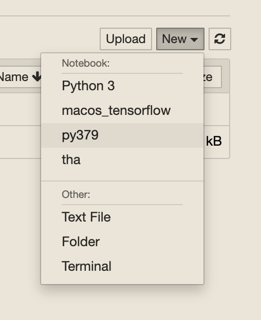
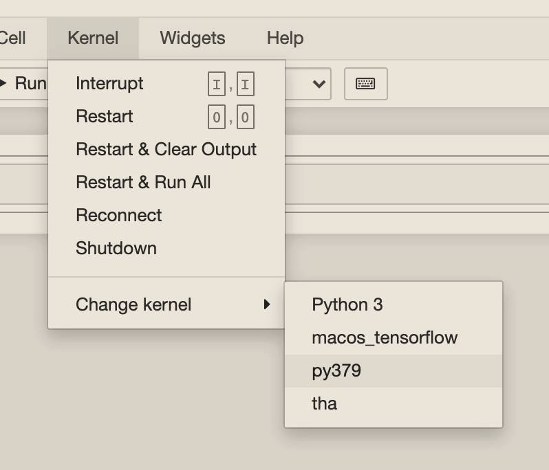

# Working In Different Python Environments On macOS Apple M1

<!-- @import "[TOC]" {cmd="toc" depthFrom=2 depthTo=6 orderedList=false} -->

<!-- code_chunk_output -->

- [Summary](#summary)
- [Why Different Environments?](#why-different-environments)
- [Preconditions](#preconditions)
- [Getting Started](#getting-started)
  - [Install Python Version Manager `pyenv`](#install-python-version-manager-pyenv)
    - [Prepare your shell (Z Shell or Bash)](#prepare-your-shell-z-shell-or-bash)
    - [Install the desired Python Version via `pyenv`](#install-the-desired-python-version-via-pyenv)
  - [Install Conda Package Manager](#install-conda-package-manager)
    - [Creating Environments with Conda](#creating-environments-with-conda)
      - [Set The Desired Python Version](#set-the-desired-python-version)
    - [Create A New Environment](#create-a-new-environment)
    - [Activate the Environment](#activate-the-environment)
    - [Install Jupyter Kernel with this name](#install-jupyter-kernel-with-this-name)
    - [Start Jupiter Notebook and Change Kernel](#start-jupiter-notebook-and-change-kernel)

<!-- /code_chunk_output -->

## Summary

After the reading, you will get to know:

- Configuring different Python Environments
- PyEnv
- Conda / Anaconda
- Jupyter Notebook

## Why Different Environments?

My motivation was to get the right environment on macOS M1 Machine for TensorFlow. `#Google` (`#TensorFlow`) obviously doesn't like to support `#Apple #MacOS` and there is - at the time of writing - still no support for `#Python 3.9`.

So I was forced to downgrade Python and I did not want to do it for the entire system.

## Preconditions

- Homebrew is installed

If not, get details here. <https://docs.brew.sh/Installation>

## Getting Started

### Install Python Version Manager `pyenv`

```shell
brew reinstall pyenv
```

#### Prepare your shell (Z Shell or Bash)

E.g., edit `~/.zshrc` and add `pyenv` related information:

```shell
export PYENV_ROOT="${HOME}/.pyenv"
export PATH="$PYENV_ROOT/bin:$PATH"
eval "$(pyenv init -)"
```

Restart your Terminal:

```shell
# Z Shell
exec zsh -l

# Bash
exec bash -l
```

#### Install the desired Python Version via `pyenv`

```shell
pyenv install --list   # List available packages
pyenv install 3.7.9
pyenv versions         # Show installed Versions
pyenv global 3.7.9     # Set version
```

### Install Conda Package Manager

```shell
arch -arm64 brew install anaconda
```

#### Creating Environments with Conda

##### Set The Desired Python Version

Verify you are currently using the desired Python Version

```shell
pyenv version # e.g. 3.7.9 (set by /Users/username/.pyenv/version)
```

#### Create A New Environment

```shell
conda create --name py379
```

```shell
  Collecting package metadata (current_repodata.json): done
  Solving environment: done

  ## Package Plan ##

  environment location: /opt/homebrew/anaconda3/envs/py379

  Proceed ([y]/n)? # Confirm with `y`
```

```shell
  Preparing transaction: done
  Verifying transaction: done
  Executing transaction: done

  # To activate this environment, use
  #
  #     $ conda activate py379
  #
  # To deactivate an active environment, use
  #
  #     $ conda deactivate
```

#### Activate the Environment

```shell
conda activate py379
```

#### Install Jupyter Kernel with this name

```shell
pip install jupyter
ipython kernel install --name "py379" --user
```

#### Start Jupiter Notebook and Change Kernel

Either you a create a new notebook by selecting the desired kernel



Or you change the kernel afterwards:


