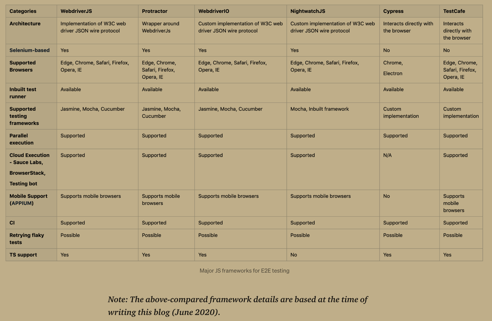

# E2E Testing: Relations & Relatives

<!-- @import "[TOC]" {cmd="toc" depthFrom=2 depthTo=6 orderedList=true} -->

<!-- code_chunk_output -->

1. [Useful Links](#useful-links)
    1. [Wikipedia: Headless Browser](#wikipedia-headless-browserhttpsenwikipediaorgwikiheadless_browser)
    2. [2020-06: Rajendran - Which E2E testing framework to use for JS-based client applications?](#2020-06-rajendran-which-e2e-testing-framework-to-use-for-js-based-client-applicationshttpsmediumcomaswinkumar4018which-e2e-testing-framework-to-use-for-js-based-client-applications-fbcac9aab680)
    3. [2020-02: Kupcewicz - Which JavaScript UI Testing Framework to Use in 2020?](#2020-02-kupcewicz-which-javascript-ui-testing-framework-to-use-in-2020httpswwwnetgurucomcodestorieswhich-javascript-ui-testing-framework-to-use-in-2020)
    4. [2020-01: Chowdhury - Best 9 JavaScript Testing Frameworks ](#2020-01-chowdhury-best-9-javascript-testing-frameworks-httpswwwlambdatestcomblogtop-javascript-automation-testing-framework)
    5. [2018-02: Cody Arsenault - 6 Popular Headless Browsers for Web Testing](#2018-02-cody-arsenault-6-popular-headless-browsers-for-web-testinghttpswwwkeycdncomblogheadless-browsers)
2. [Tools, Frameworks & Libraries](#tools-frameworks-libraries)
    1. [Cypress.io](#cypressio)
    2. [Puppeteer](#puppeteer)
    3. [TestCafe](#testcafe)
    4. [Nightwatch](#nightwatch)
    5. [Zombie.js](#zombiejs)

<!-- /code_chunk_output -->

## Useful Links

### [Wikipedia: Headless Browser](https://en.wikipedia.org/wiki/Headless_browser)

### [2020-06: Rajendran - Which E2E testing framework to use for JS-based client applications?](https://medium.com/@aswinkumar4018/which-e2e-testing-framework-to-use-for-js-based-client-applications-fbcac9aab680)

Excerpt (Puppeteer missing!):

### [2020-02: Kupcewicz - Which JavaScript UI Testing Framework to Use in 2020?](https://www.netguru.com/codestories/which-javascript-ui-testing-framework-to-use-in-2020)

### [2020-01: Chowdhury - Best 9 JavaScript Testing Frameworks ](https://www.lambdatest.com/blog/top-javascript-automation-testing-framework/)

### [2018-02: Cody Arsenault - 6 Popular Headless Browsers for Web Testing](https://www.keycdn.com/blog/headless-browsers)

## Tools, Frameworks & Libraries

### Cypress.io

>[>> Website](https://www.cypress.io/)

### Puppeteer

>[>> Website](https://github.com/puppeteer/puppeteer)

### TestCafe

>[>> Website](https://github.com/DevExpress/testcafe)

### Nightwatch

>[>> Website](https://github.com/nightwatchjs/nightwatch)

## Simulations & Co

### Zombie.js

>[>> Website](https://github.com/assaf/zombie)

### Simple Browser

> [>> Website](https://github.com/SimpleBrowserDotNet/SimpleBrowser)